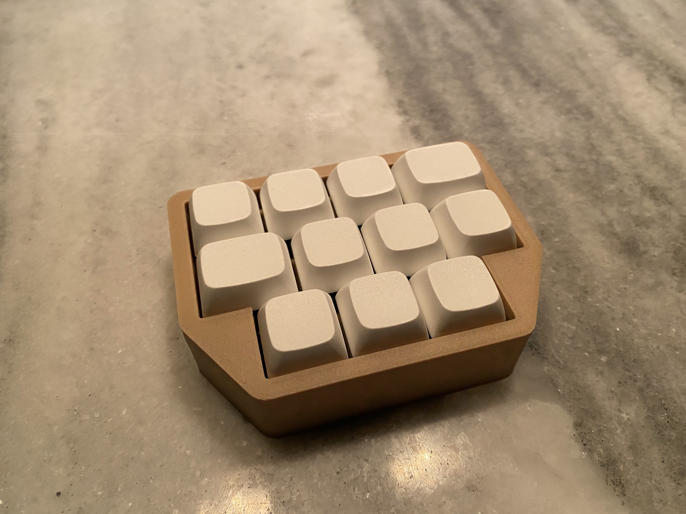

**This repo has been depreciated in favor of the [online app](http://case-gen.cbkbd.com:3838/)!**

Keyboard Case Generator

  

This is an Openscad script that will produce a keyboard plate and case for a proMicro based keyboard.  

To use it, open keyboard_full.scad.  

Set your `bezelGap` to determine the gap from the keyCaps to the bezel in mm.  

Set `bezelWidth` to determine the size of your bezels in mm.  

Set `baseThickness` to determine the thickness of the base of the case in mm.  

Use [The Layout Generator](https://40percent.shinyapps.io/caseGenSyntax/), which uses a lightweight keybaord layout syntax, to get `keyPositionsX`, `keyPositionsY`, `keySizes`, and `keys` for your layout.  

Set `usbIndex` to determine under which switch your pro micro sits. *The index starts with 0*. The usb hole will always be placed at the "top" of the case.  

Use `usbWidth` and `usbHeight` to set the size of the usb cutout in mm.  

`xSpacing`, `ySpacing`, `xCut` and `yCut` determing the switch spacing and the switch plate cutout size. They default to mx switch standards.   
Set `$fn` to determine the quality of the render.  

`holeIndecies` determines at which switches the standoff holes will be placed. Remember, the index starts at 0. The holes will be places to the southwest of the switch at the origin of the switch footprint and will be of size `holeSize`.  

Now you are ready to go! Press f6. When you are ready to print your case, copy your settings to the `keyboard_case_only.scad` and `keyboard_plate.scad` files and produce the plate and case for printing! Export the stl and slice it. 
